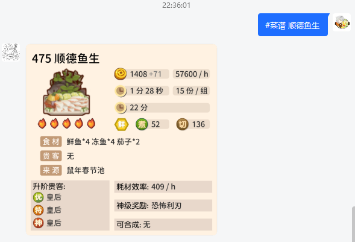

# bcjh-bot

这是一个用于快捷查询爆炒江湖游戏数据的 QQ 机器人，可以在需要查询游戏数据又不想翻开图鉴网的时候做一些简单查询。

## 使用说明

私聊机器人或向机器人所在的 QQ 群发送指定格式的指令，即可查询到相关游戏数据信息。

**详细说明文档请查看：** http://bcjhbot.billdex.cn

简单示例如下所示，发送 `#菜谱 顺德鱼生`，即可获取`顺德鱼生`的菜谱信息：

## 数据源说明

数据源来自 **L 大佬的 爆炒江湖图鉴网** ：https://foodgame.gitee.io

## 致谢

- 感谢[L图鉴网](https://foodgame.gitee.io)与[白菜菊花](https://bcjh.xyz)的数据接口，这是查询程序内所有游戏数据来源的基础。
- 感谢[Mrs4s/go-cqhttp](https://github.com/Mrs4s/go-cqhttp)提供的轻量QQ客户端程序，这是这个QQ机器人项目得以运行的基础。
- 感谢Boketto、闲时、小熊、梨大只提供的游戏数据
- 感谢制作与贡献游戏攻略的大佬们
- 感谢各位爆炒江湖游戏群管理员对查询机器人的理解与支持
- 感谢爆炒江湖交流09群的小伙伴们在测试期间的支持与鼓励
- 感谢每一位提供问题反馈和功能建议的玩家

## Support

感谢以下小伙伴的资金支持

| QQ         | 昵称      | 金额 |
| ---------- |---------| ---- |
| 294728048  | 葡萄      | 110  |
| 2483713647 | 阿帅帅     | 20   |
| 1726688182 | 不要鸡蛋啊喂  | 6.66 |
| 2226179137 | 奇奇怪怪的羽毛 | 6.66 |
| 1285600917 | 小玄猫     | 6.66 |

感谢 [JetBrains](https://jb.gg/OpenSource.) 提供的开源项目 License

